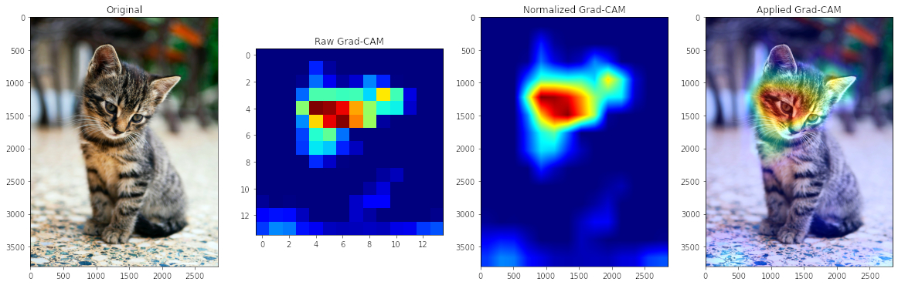

# GradCAM

> GradCAM (Gradient-Weighted Class Activation Mapping)

Technique show heatmap of interest region that CNN model focuses on through conv-layer activations.

[img resources](https://dlhr.de/8)
