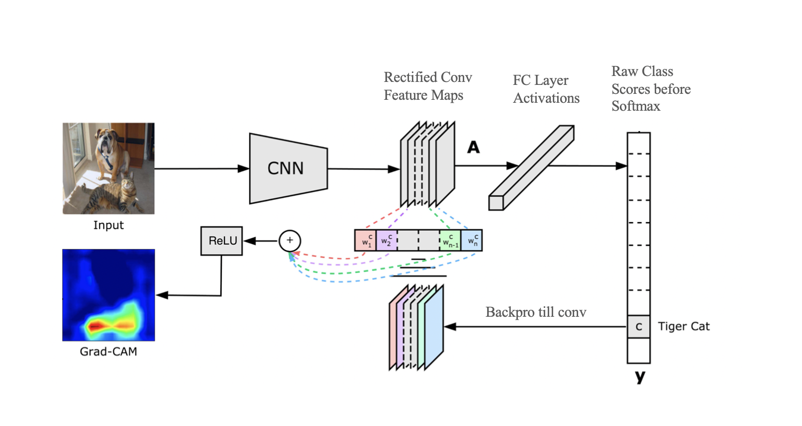
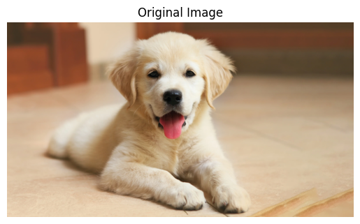
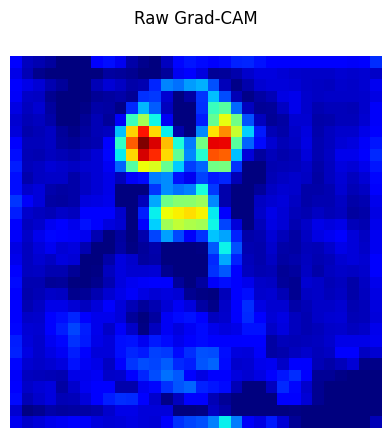
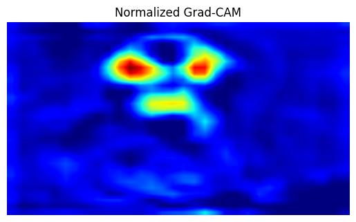
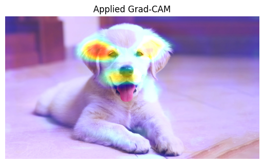
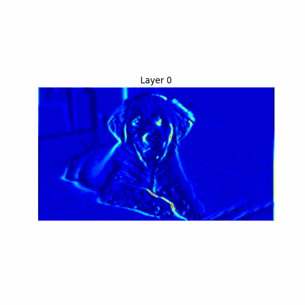

# GradCAM

> GradCAM (Gradient-Weighted Class Activation Mapping)

Technique show heatmap of interest region that CNN model focuses on through conv-layer activations.

**Cons** : works with All CNN architecture models

**Architecture**  

Original Image :  

Step 1 : Calculate the Grad-CAM  

Step 2 : Normalize it  

Step 4 : Add it to the original image  

Frames shows conv-layer in VGG-19 Model activation for the Dog image :  

## Reference

[Grad-CAM paper](https://arxiv.org/pdf/1610.02391)
